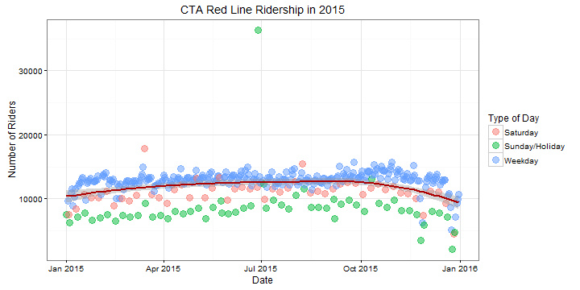

## A Basic Shiny App

We built a Shiny app that looks at a subset of the Chicago Transit Authority's  'L' Station Entries - Daily Totals data set. The full set has over 790,000 rows.  We looked at the subset consisting of Red Line stations for the year 2015.

The full data set can be found [here](https://data.cityofchicago.org/Transportation/CTA-Ridership-L-Station-Entries-Daily-Totals/5neh-572f).

--- .class #id 

## Using the App

We can do the following with our app, which can be found [here](https://ugaliguy.shinyapps.io/shiny-app/).  

The source code can be found [here](https://github.com/ugaliguy/Coursera-Data-Science/tree/master/Developing-Data-Products).

### Table

* Look at the number of passengers on a given day
* Look at the number of passengers at a given station
* Reorder the columns of the table

### Statistics

* Plot the number of passengers at a particular station for the year 2015
* Observe trends in ridership with respect to the day of the week.

--- .class #id 

## An Example - Table

The table below shows the ridership numbers on June 28th 2015 (for 10 of the 33 avaiable records).


```
##        ï..station_id        stationname       date        daytype rides
## 751286         41230      47th-Dan Ryan 2015-06-28 Sunday/Holiday  2825
## 751496         41300             Loyola 2015-06-28 Sunday/Holiday  3986
## 751557         41320 Belmont-North Main 2015-06-28 Sunday/Holiday 36323
## 751706         41380          Bryn Mawr 2015-06-28 Sunday/Holiday  4687
## 751736         41400          Roosevelt 2015-06-28 Sunday/Holiday  9345
## 751796         41420 Addison-North Main 2015-06-28 Sunday/Holiday 20435
## 751826         41430               87th 2015-06-28 Sunday/Holiday  3861
## 751886         41450      Chicago/State 2015-06-28 Sunday/Holiday 12217
## 751976         41490           Harrison 2015-06-28 Sunday/Holiday  3389
## 752066         41660         Lake/State 2015-06-28 Sunday/Holiday 18462
```


--- .class #id 

## Example - Statistics

The plot below shows the ridership numbers for the Belmont-North Main station in 2015.



